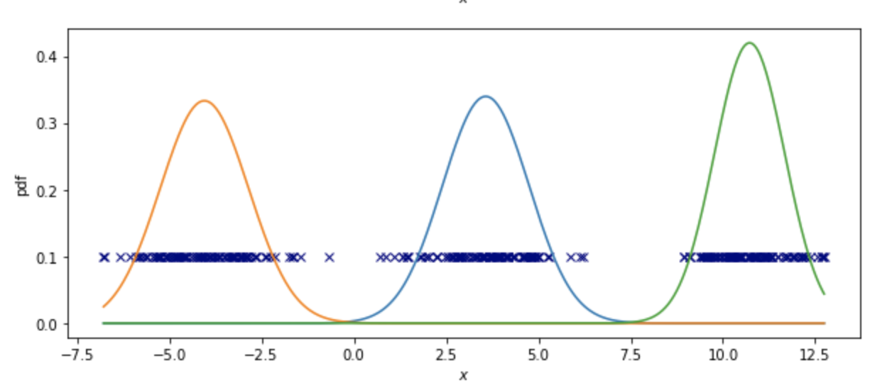

# Gaussian Mixture Model (Expectation Maximization for training)

`gaussian-mixture-model.py` implements the Expectation Maximization algorithm to generate a Gaussian Mixture Model of three distributions on 1-dimensional data. The data is randomly generated based on three different fixed means and variances, and then it is passed into the `GaussianMixtureModel1D` class to run the EM algorithm.

The Expectation Maximization algorithm here finds three parameters (mean, variance, and scale) for three distribution models of the data.

First, it uses the following Probability Density Function to calculate the likelihood of a training point given mean and variance.

=\frac{1}{\sqrt{2\pi\sigma^2_k}}exp\Big(-\frac{(x-\mu_k)^2}{2\sigma^2_k}\Big))

Then it finds the probability that a training point belongs to a certain distribution.

}=\frac{f(x^{(i)}|\mu_k,\sigma^2_k)\phi_k}{\sum_{k=1}^{K}f(x^{(i)}|\mu_k,\sigma^2_k)\phi_k})

Lastly, it re-estimates the parameters (mean, variance, and scale).

}x^{(i)}}{\sum_i%20b_k^{(i)}})

}(x^{(i)}-\mu_k)^2}{\sum_i%20b_k^{(i)}})

})

## Analysis

After running the Expectation Maximization algorithmn on the three sets of data, the following distributions we generated. Seems it worked pretty well!

)