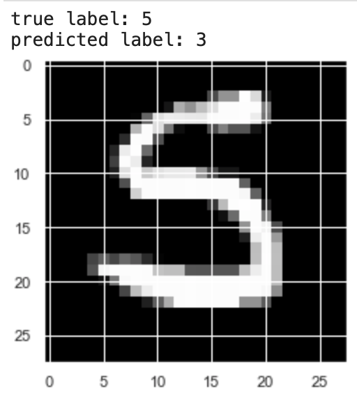

# k Nearest Neighbors

`knn.py` implements the k Nearest Neighbor algorithm with a specified number of prototypes (samples from the training data set). It resolves ties naively by simply randomly selecting one label or the other. I would modify the implementation to resolve ties by selecting the single nearest neighbor.

I trained and tested it on the MNIST handwritten digits dataset.

## Analysis

Within `knn.py` you will find a number of plots that can be generated. I did this to analyze the performance of the classifier and learn more about how different hyperparameters affected accuracy.

### # of Training examples vs. Test accuracy

The accuracy is very low here because I arbitrarily set the number of prototypes to `10` simply to speed up computation, but the general idea is that there appears to be no clear relationship between the number of training examples and test accuracy.

### # of Nearest Neighbors vs. Test accuracy

This computes the test accuracy 10x for each value of `k` and averages the results. There is a very clear trend between a higher number of nearest neighbors and lower accuracy. It also appears that even values for `k` result in lower test accuracy, which is likely due to the naive tie resolution discussed above.

### Predicted label vs. True label

The confusion matrix below shows the counts of predicted labels vs. true labels for a training example. It appears that images with a true label of 9, 4, 7, 5, and 3 are frequently misclassified. Thus, here are some photos of misclassified examples to help us diagnose why that's happening.

