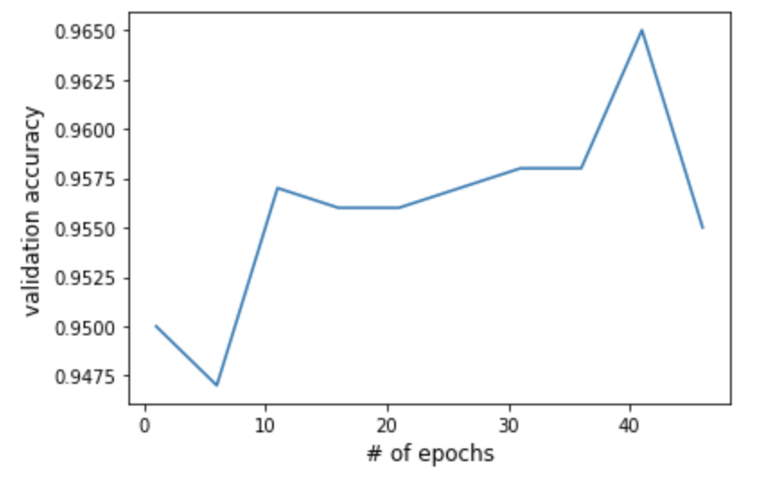

# Neural Network

`neural-network.py` implements a Neural Network, using the Backpropagation algorithm for training and the Forward Propagation algorithm for prediction. I trained and tested it on a subset of the MNIST dataset (where true labels are either 3, 7, 8, or 9) to reduce the complexity of training. These images were scaled down to a size of 21x21, flattened into 441x1 vectors, and normalized to have values between 0-1 (rather than 0-255) to be fed as inputs into the network.

### Learning Rate, Regularization Strength, and Architecture

For this Neural Network, there were 3 major hyperparamters: learning rate, regularization strength, and architecture. I found that a learning rate of 1.5 and a regularization strength of 0.000001 proved to be generally more performant than diffeerent values across different architectures. There may be better values though, I was just limited by the complexity of training to search for better values.

See the graph below to see the performance of an architecture after varying numbers of epochs with an input layer of width 441, a hidden layer of width 100, and an output layer of 4.

See the graph below to see the performance of an architecture after varying numbers of epochs with an input layer of width 441, a hidden layer of width 150, and an output layer of 4.

See the graph below to see the performance of an architecture after varying numbers of epochs with an input layer of width 441, a hidden layer of width 200, another hidden layer of 100, and an output layer of 4.

After testing out many different architectures, the network interestingly performed the best on the MNIST data when there was just a single hidden layer rather than multiple. 