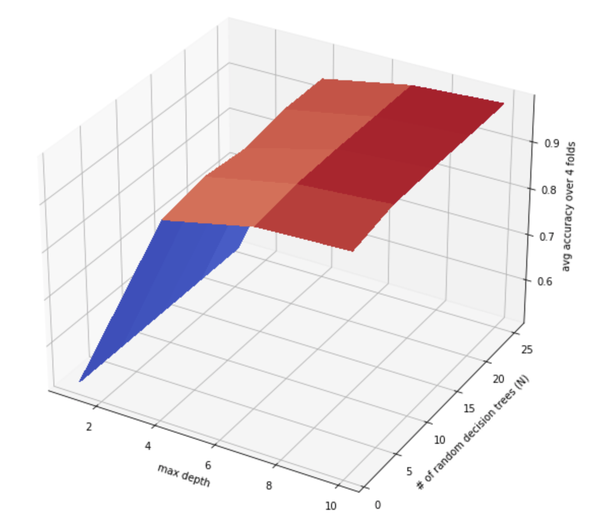

# Random Decision Forest

`random_decision_forest.py` implements the Random Decision Forest algorithm using the Random Decision Tree algorithm I implemented in another project (`random_decision_tree`). I trained and tested it on a subset of the MNIST dataset (where true labels are either 3 or 8) to reduce the problem down to binary classification. It simply predicts whether the label of an image is 3 or 8.

### Optimal Number of RandomDecisionTrees & Maximum RandomDecisionTree depth

For this RandomDecisionForest, there are 2 major hyperparameters: the number of RandomDecisionTree's to train and use for prediction, and the maximum allowed depth of these RandomDecisionTrees. 

After running a 3-Fold Cross Validation on the training data, I found the accuracy to be maximized when the number of RandomDecisionTree's was `4` and the maximum allowed depth was `7`. See the graph below to see how these two hyperparameters affect accuracy.

### Accuracy with Optimal Hyperparameters

After fixing the number of RandomDecisionTree's to be `4` and the maximum allowed depth of a RandomDecisionTree to be `7`, I found a test accuracy of `97.65%` on the test data.