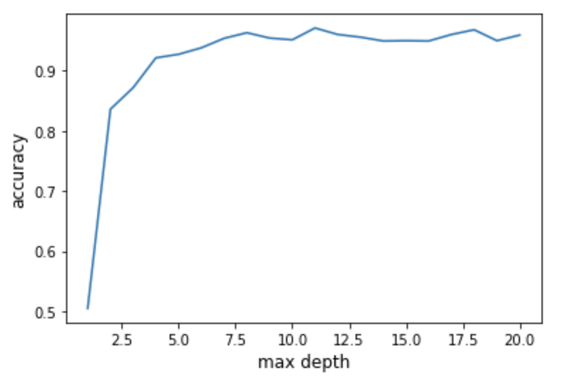

# Random Decision Tree

`random_decision_tree.py` implements the Random Decision Tree algorithm, which is the basis for the popular Random Decision Forest algorithm. I trained and tested it on a subset of the MNIST dataset (where true labels are either 3 or 8) to reduce the problem down to binary classification. It simply predicts whether the label of an image is 3 or 8.

It is called a "Random" Decision Tree, because it tries generating many random split vectors on the data and then picks whichever results in the greatest decrease of the Gini Index on the data. I chose the Gini Index because it is a measure of uncertainty that seems to be very effective.

### Accuracy

When I fixed the number of random split vectors to be generated and the maximum allowed depth of the tree to be `10`, I found an accuracy of `95.88%` on the test set.

I went on to evaluate the relationship between accuracy and the maximum allowed depth of the tree. From the plot below, you will notice a massive increase in accuracy between a max_depth of 1 and max_depth and 2. Accuracy continues increasing fairly strongly until max_depth reaches 9 or 10. This makes sense, because when we only have a max_depth of 1 we have very strong bias (underfitting) which leads to poor accuracy. Then as max_depth increases our model becomes better fitted (to a point, I imagine it will begin to perform worse as we make too many splits and overfit).

)